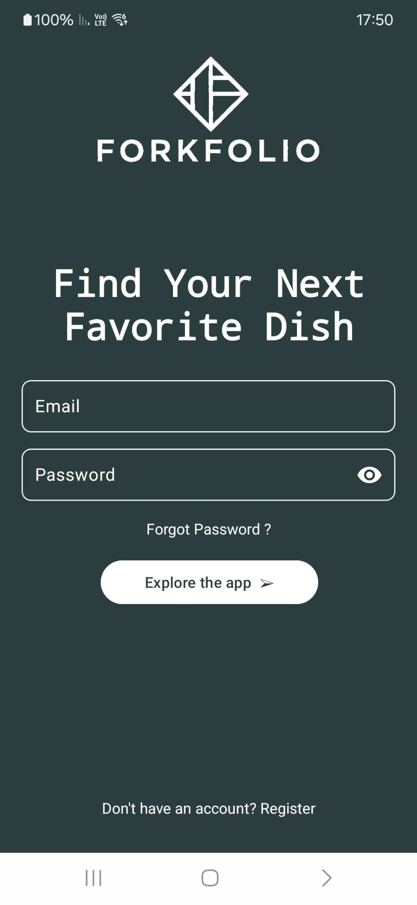
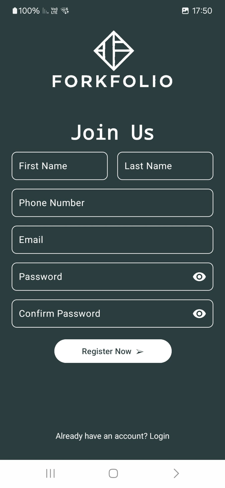
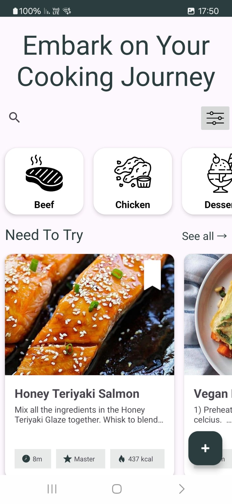
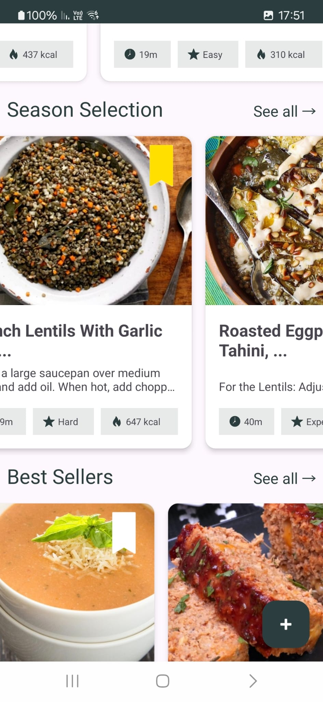
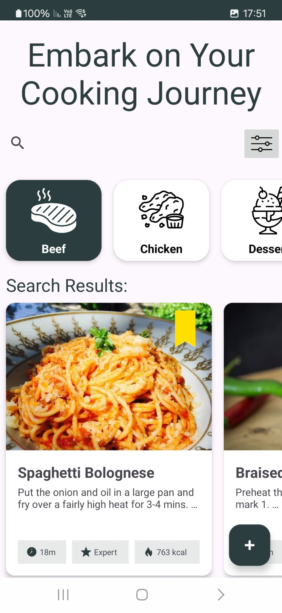
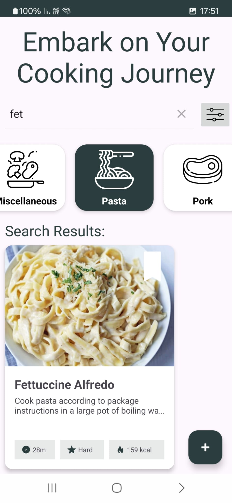
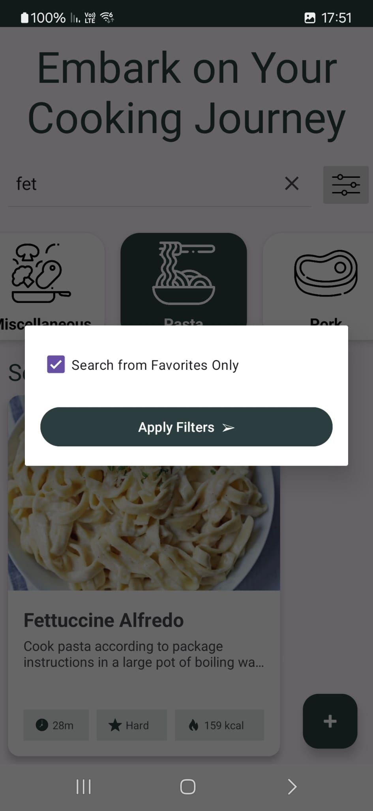
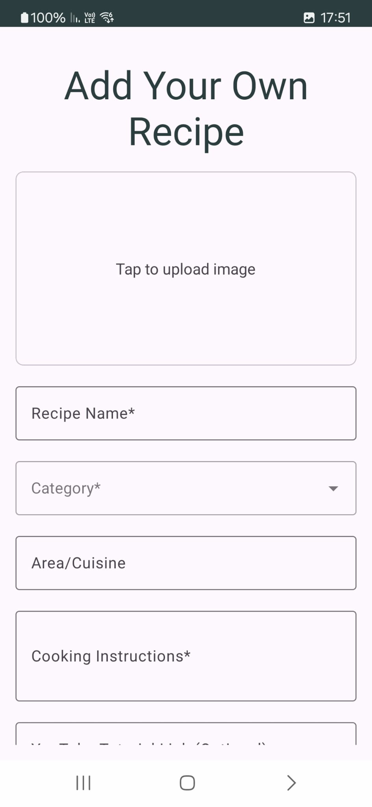
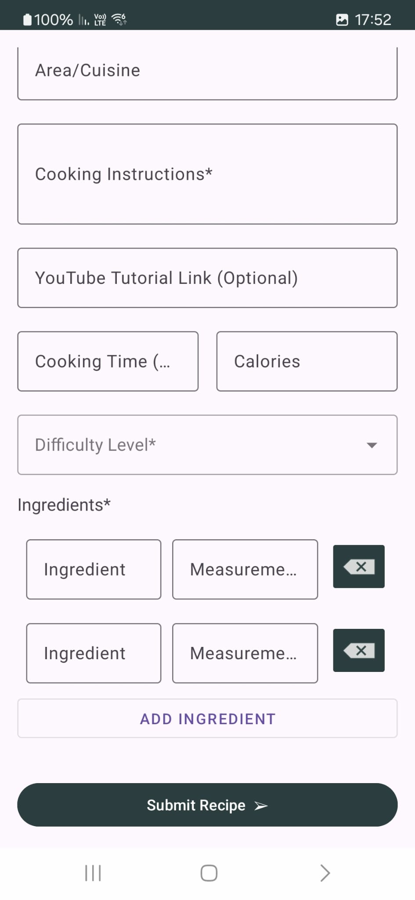

# Recipe Manager Android App

This Android app is a Recipe Manager that allows users to browse, search, and filter recipes. The app includes functionality for managing favorite recipes, adding new recipes, and filtering recipes based on categories and favorites. The app is built with Java in Android Studio.

## Features

### 1. **Browse Recipes by Category**
   - The app allows users to browse recipes based on different categories like:
     - Beef
     - Chicken
     - Dessert
     - Lamb
     - Miscellaneous
     - Pasta
     - Pork
     - Seafood
     - Side
     - Starter
     - Vegan
     - Vegetarian
     - Breakfast
     - Goat

### 2. **Search Recipes**
   - A `SearchView` is provided to search recipes by their names.
   - Recipes will be filtered in real-time as the user types in the search box.
   - Search results can be shown or hidden based on whether a valid search query is entered.

### 3. **Filter Recipes by Favorites**
   - A button (ImageButton) in the app opens a modal with a checkbox option to filter recipes based on favorites.
   - Users can select the checkbox to search only for favorite recipes.
   - The app filters the recipes to show only those marked as favorites if the checkbox is selected.

### 4. **Add New Recipe**
   - Users can add new recipes using a floating action button (`FAB`).
   - The recipe adding process allows users to input:
     - Recipe name
     - Ingredients
     - Instructions
     - Category
     - A favorite toggle to mark the recipe as a favorite
   - The recipe is stored and displayed in the app once added.

### 5. **Favorites**
   - Recipes can be marked as favorites and can later be filtered based on the favorite status.
   - The app remembers which recipes are marked as favorites across sessions.

### 6. **Category-wise Recipe Display**
   - Recipes are displayed in horizontal sections for categories such as:
     - "Need to Try"
     - "Seasonal"
     - "Best Sellers"
   - Users can select a category, and the app will show a list of recipes specific to that category.

### 7. **Responsive UI**
   - The app's UI adapts to different screen sizes and orientations.
   - Recipes are displayed in a clean and structured way using `RecyclerView` and `LinearLayoutManager`.
   - Dynamic updating of RecyclerViews when search results change or filters are applied.

## Installation

To get started with the app, clone the repository and open it in Android Studio:

```bash
git clone https://github.com/yourusername/recipe-manager.git
```

# Image Gallery

Explore the various features and UI of the Recipe Manager app through the images below:

|  |  |  |
|-----------------------------|----------------------------|------------------------------|
| **Login Screen** - User login page where users can sign in with their credentials. | **Main Screen** - Displays the list of recipe categories for browsing. | **Search Screen** - Search functionality that allows users to find recipes by name. |

|  |  |  |
|---------------------------------|----------------------------------|---------------------------------|
| **Add Recipe Screen** - Allows users to add new recipes, including ingredients and instructions. | **Recipe Detail Screen** - View detailed recipe information such as ingredients and preparation steps. | **Favorites Screen** - Displays the list of recipes marked as favorites by the user. |

|  |  |  |
|-------------------------------------|---------------------------------|--------------------------------|
| **Category Filter Screen** - Filter recipes based on different categories such as Vegan, Dessert, etc. | **Recipe Item Screen** - A single recipe item showing ingredients, instructions, and the option to add to favorites. | **Settings Screen** - User preferences, including theme options and notification settings. |
